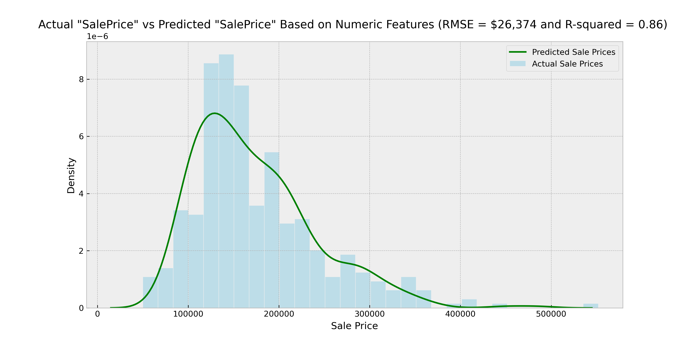

# Where Data Meets Domain Expertise: Predicting House Sale Prices

## Problem Statement
The rise of real estate data-driven tech companies like Redfin is transforming the local market dynamics where customers are expecting better house price predictions. Nguyening Deals Agency, a trusted local real estate company facing intense competitions, is facing a dilemma:
“Should we invest in sophisticated quantitative prediction models or train our agents to see value beyond the numbers and rely on qualitative metrics to predict house sale prices?" 

This linear regression project aims to answer the following questions:

1) What are the key qualitative and quantitative metrics to evaluate a house sale price?
2) Given the selected features, what is the overall predictive accuracy of the house sale price prediction model?
3) What is the performance of the quantitative, numeric-features-only regression model at predicting house sale prices?
4) What is the performance of the qualitative, nominal-features-only regression model at predicting house sale prices?
5) What is the performance of the qualitative, ordinal-features-only regression model at predicting house sale prices?
6) Given the performance of the regression models, what is the investment recommendation for Nguyening Deals Agency?
   
## Executive Summary

The Ames Housing Dataset contains information on 2930 properties sold in Ames, Iowa between 2006 and 2010 (Project Data Documentation)[https://jse.amstat.org/v19n3/decock/DataDocumentation.txt]. The dataset includes 82 metrics typically used in assessing the value of a house including 23 nominal , 23 ordinal, 14 discrete, and 20 continuous variables. Quantitative features, such as house size in square feet (continuous) or the number of bathrooms (discrete), can provide direct signals about the home value. Qualitative features, such as the home neighborhood (nominal) or the home condition (ordinal), can also be important predictors of home sale price. The data source is a subset of the Ames Housing dataset that is split into a "train" dataset  and a "test" dataset.

Through detailed Exploratory Data Analysis (EDA) and review of the data source documentation, 29 important features were identified to have the most impact on house sale prices. A detailed breakdown of these 13 numeric, 7 nominal and 9 ordinal features are summarized in the data dictionary section below.

Preprocessing of the train dataset includes removing outliers and filling in null data points appropriately for numeric, ordinal, and nominal data types. A custom data cleaning function was used to thoroughly clean both 'train' and "test" datasets. Then the data was encoded and transformed according to the data type with polynomial features fitting and min-max scaling applied to the numeric features, one-hot-encoding applied to the nominal features, and ordinal encoding and min-max scaling applied to then ordinal features. The "train.csv" dataset was split into 75% train and 25% test to cross validate the model performance. Four multilinear regression models were built and their performances were evaluated using the R-squared and Root Mean Squared Error (RMSE) values.

|House Price Prediction Model|R-squared|RMSE|
|---|---|---|
|**29 features**|*0.92*|\$22,864|
|**13 numeric features**|*0.86*|\$26,374|
|**9 ordinal features**|*0.74*|\$40,881|
|**7 nominal features**|*0.65*|\$46,348|

The best prediction model which utilized 29 features achieves an R-squared value of 0.92, indicating that 92% of the variability in "SalePrice" can be explained by the multilinear regression model built on selected 29 features. This model also achieves the lowest RMSE value of \\$22,864. In other words, on average this model predicts a home "SalePrice" that is \\$22,864 away from the actual sale price, or roughly 12.6% of the average home "SalePrice" value of \\$181,061. This model was also evaluated against other house "SalePrice" prediction models in a [Kaggle competition](https://www.kaggle.com/competitions/adobe-dsb-34/leaderboard) using the mystery "test.csv" dataset and it is ranked second place with an RMSE score of 21063 using the mystery "test" dataset.


The numeric features only model is the 2nd best model with an R-squared of 0.86 and an RMSE \\$26,374.



The ordinal features only model is the 3rd best model with an R-squared of 0.74 and an RMSE \\$40,881. 


In last place is the nominal features only with a R-squared of 0.65 and an RMSE of \\$46,348.


The house 'SalePrice' regression model highlights the interaction between quantitative metrics and qualitative factors in property valuation. The best regression model performance shows that while the quantitative numeric features provide a reliable foundation in estimating home sale prices, integrating qualitative nominal and ordinal features significantly improves the model accuracy and reliability.

# Data Dictionary

The primary data source is a subset of the Ames Housing Dataset used by the Ames Assessor's Office in computing assessed values for individual resident properties sold in Ames, Iowa from 2006 to 2010 [Ames Housing Data Documentation](https://jse.amstat.org/v19n3/decock/DataDocumentation.txt). The primary dataset is split into "train" set and a "test" set. The "train" set consists of 1538 observations and 82 data columns, including "SalePrice", and was used to build the regression models and make predictions on house "SalePrice". The "test" set consists of 513 observations and 81 data columns, excluding "SalePrice", that was used to make "SalePrice" predictions for the Kaggle competition.

Out of 81 features, 29 features were selected with 13 numeric, 7 nominal and 9 ordinal features.

|Feature|Type|Dataset|Description|
|---|---|---|---|
|**Gr Liv Area**|*numeric*|Ames|Above grade (ground) living area in square feet.|
|**Total Bsmt SF**|*numeric*|Ames|Total square feet of basement area.|
|**Garage Cars**|*numeric*|Ames|Size of garage in car capacity.|
|**Garage Area**|*numeric*|Ames|Size of garage in square feet.|
|**Year Built**|*numeric*|Ames|Original construction date.|
|**Year Remod/Add**|*numeric*|Ames|Remodel date (same as construction date if no remodeling or additions).|
|**TotRms AbvGrd**|*numeric*|Ames|Total rooms above grade (does not include bathrooms).|
|**Mas Vnr Area**|*numeric*|Ames|Masonry veneer area in square feet.|
|**Fireplaces**|*numeric*|Ames|Number of fireplaces.|
|**Lot Frontage**|*numeric*|Ames|Linear feet of street connected to property.|
|**Lot Area**|*numeric*|Ames|Lot size in square feet.|
|**porch_deck_sqft**|*numeric*|Ames, calculated|Total square feet of porch and deck areas.|
|**all_baths_count**|*numeric*|Ames, calculated|Total count of bathrooms, including full bath and half bath.|
|**Neighborhood**|*nominal*|Ames|Physical locations within Ames city limits.|
|**MS Zoning**|*nominal*|Ames|Identifies the general zoning classification of the sale.|
|**Bldg Type**|*nominal*|Ames|Type of dwelling.|
|**Mas Vnr Type**|*nominal*|Ames|Masonry veneer type.|
|**House Style**|*nominal*|Ames|Style of dwelling.|
|**Foundation**|*nominal*|Ames|Type of foundation.|
|**Sale Type**|*nominal*|Ames|Type of sale.|
|**Overall Qual**|*ordinal*|Ames|Rates the overall material and finish of the house.|
|**Overall Cond**|*ordinal*|Ames|Rates the overall condition of the house.|
|**Exter Qual**|*ordinal*|Ames|Evaluates the quality of the material on the exterior.|
|**Bsmt Qual**|*ordinal*|Ames|Evaluates the height of the basement's ceiling.|
|**Heating QC**|*ordinal*|Ames|Heating quality and condition.|
|**Kitchen Qual**|*ordinal*|Ames|Kitchen quality.|
|**Functional**|*ordinal*|Ames|Home functionality rating.|
|**Electrical**|*ordinal*|Ames|Electrical system.|
|**Garage Qual**|*ordinal*|Ames|Garage quality.|

# Conclusions and Recommendations
The EDA and comparison of the four models' performances confirms the critical role both quantitative and qualitative metrics play in property valuation. For Nguyening Deals Agency, this dual-focus approach not only sets them apart but also aligns with their commitment to providing comprehensive and nuanced real estate services.

Nguyening Deals Agency should take a hybrid approach in making investments to grow their business:
- train their agents on a data-first mindset in house price evaluations,
- empower knowledge sharing of subjective insights during biweekly or monthly “state of the market” group discussions, and
- start a small-scaled data science project to collect internal data on these metrics, particularly on ordinal features like home neighborhoods. 

# Sources
[Ames Housing Dataset](https://jse.amstat.org/v19n3/decock/DataDocumentation.txt)

[Ames, Iowa: Alternative to the Boston Housing Data as an End of Semester Regression Project by Dean De Cock](https://jse.amstat.org/v19n3/decock.pdf)

# Repo Directory
```
Ames Housing Project File Directory
|__ code
|   |__ 01_Data_Collection_and_Cleaning.ipynb   
|   |__ 02_EDA.ipynb
|   |__ 03A_Model_ridge_minmax_full.ipynb 
|   |__ 03B_Model_ridge_minmax_numerics.ipynb
|   |__ 03C_Model_ridge_minmax_nominal.ipynb
|   |__ 03D_Model_ridge_minmax_ordinal.ipynb
|   |__ KAGGLE_Model_elasticnet.ipynb
|   |__ KAGGLE_Model_lasso.ipynb
|   |__ KAGGLE_Model_ridge_polyminmax.ipynb
|   |__ KAGGLE_Model-ridge.ipynb
|__ datasets
|   |__ train.csv
|   |__ test.csv
|   |__ an_kaggle_submission_1.csv
|   |__ an_kaggle_submission_2_elasticnet.csv
|   |__ an_kaggle_submission_3_lasso.csv
|   |__ an_kaggle_submission_5_polyminmax_params.csv
|   |__ test_trimmed.csv
|   |__ train_trimmed.csv
|__ images
|   |__ OverallQual.png
|   |__ neighborhood.png
|   |__ GrLivArea_outlier.png
|   |__ Features_with_Nulls.png
|   |__ Actual_salePrice_vs_Prediction_Ordinal_Features.png
|   |__ Actual_salePrice_vs_Prediction_Numeric_Features.png
|   |__ Actual_salePrice_vs_Prediction_Nominal_Features.png
|   |__ Actual_salePrice_vs_Prediction_All_Features.png
|__ Where_Data_Meets_Domain_Ames_Housing_Regression_Model.pdf
|__ DataDocumentation.txt
|__ README.md
```
